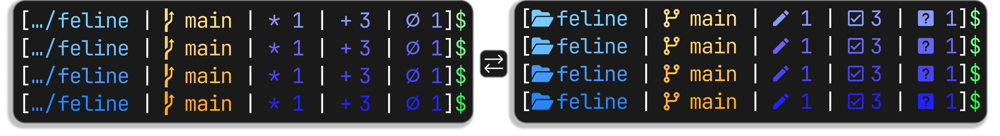

<div align="center">
  <h3>🌠🙀 Feline For <a href="https://starship.rs/">Starship</a></h1>
  <p style="text-align: center;">A clean, vivid prompt preset for Starship. Built with high-contrast palettes inspired by <a href="https://github.com/catppuccin/starship">Catppuccin</a>, but more compact and vibrant. Provides three variants: Nerd Font icons, emojis, or plain text.</p>
  
</div>

## 📦 Installation

1. Run the following command in terminal

Windows:
```powershell
iwr -useb "https://raw.githubusercontent.com/Noktomezo/FelineForStarship/refs/heads/main/scripts/setup.ps1" | iex
```

Linux and macOS:
```bash
bash <(curl -fsSL "https://raw.githubusercontent.com/Noktomezo/FelineForStarship/refs/heads/main/scripts/setup.sh")
```

2. Select a prompted variant:
- 1: Standard (Nerd Font) — `feline.toml`
- 2: Emoji — `feline-emoji.toml`
- 3: Plain text — `feline-plain-text.toml`

3. Reload shell (don't needed actually) to see the result.

> [!TIP]
> (For PowerShell users) Sometimes you may not needed all the previous prompt information, so you can replace the previous-printed prompt with just `$` symbol. For setup see [Starship docs](https://starship.rs/advanced-config/#transientprompt-in-powershell).

## 🎨 Palettes

Four schemes with consistent keys (e.g., `goldenspark` for branches, `lime_zest` for success). Define at the top of your config.

| Palette       | Base Theme      |
| ------------- | --------------- |
| vivid_sunset  | Warm glow       |
| electric_dawn | Neon burst      |
| radiant_storm | Thunder energy  |
| blaze_echo    | Fiery afterglow |

Edit `palette` key in `~/.config/starship.toml` to change it.

## 📝 Variants

- **Standard**: Nerd Font icons (e.g., 󰱒 for staged). Requires [Nerd Font](https://www.nerdfonts.com/).
- **Emoji**: Unicode emojis (e.g., ✅ for staged).
- **Plain text**: ASCII/Unicode (e.g., + for staged).

All include directory truncation, git branch/status, and vim support.

## 📜 License

MIT. See [LICENSE](LICENSE).
