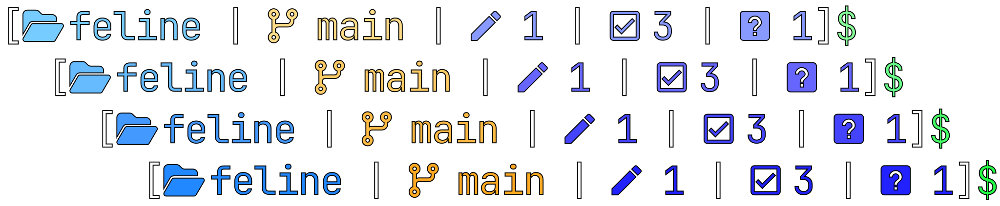

<div align="center">
  <h3>🌠🙀 Feline For <a href="https://starship.rs/">Starship</a></h1>
  <p style="text-align: center;">A clean, vivid prompt preset for Starship, rethinking the classic Linux default terminal prompt - but extended for modern workflows. It delivers high-contrast readability in a compact, vibrant layout, showing all the project info in comprehensive format. Choose from three (project affection indicator) variants: Nerd Font icons, emojis, or plain text.</p>
  
</div>

##  Installation

1. Run the following command in terminal:
```shell
# For Windows (PowerShell)
irm "https://dub.sh/feline" | iex

# For Linux and macOS (Bash)
bash <(curl -fsSL "https://dub.sh/feline")
```

2. Select a prompted variant:
- 1: Standard (Nerd Font) — `feline.toml`
- 2: Emoji — `feline-emoji.toml`
- 3: Plain text — `feline-plain-text.toml`

3. Reload shell (don't needed actually) to see the result.

> [!TIP]
> (For PowerShell users) Sometimes you may not needed all the previous prompt information, so you can replace the previous-printed prompt with just `$` symbol. For setup see [Starship docs](https://starship.rs/advanced-config/#transientprompt-in-powershell).

##  Palettes

To change palette, edit `palette` key in `~/.config/starship.toml` to one of the following:
- `vivid_sunset`
- `electric_dawn`
- `radiant_storm`
- `blaze_echo`

##  Variants

- **Standard**: Nerd Font icons (e.g., 󰱒 for staged, 󰏫 for modified,  for ahead).
- **Emoji**: Unicode emojis (e.g.,  for staged,  for modified,  for ahead).
- **Plain text**: ASCII/Unicode (e.g., + for staged, * for modified, ↑ for ahead).

All include directory truncation, git branch/status, and vim support.

&nbsp;

<div align="center">
  
  <p>Made with . Published under <a href="LICENSE">MIT license</a>.</p>
</div>
